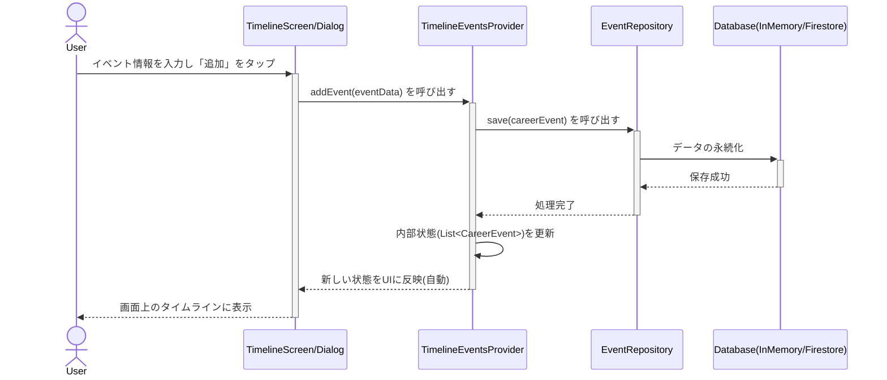

## キャリア記録アプリ ソフトウェアアーキテクチャ設計書

**Version: 1.0**

### 1. 概要

本文書は、Flutterで開発する「キャリア記録アプリ」のソフトウェアアーキテクチャを定義するものです。

本設計の目的は、インフラ基盤（Firebase）との連携を最適化し、高いメンテナンス性、テスト容易性、拡張性を確保することです。また、AIコーディングエージェントによる開発支援を効率化することも重要な設計目標とします。

### 2. 設計思想とアーキテクチャスタイル

- **アーキテクチャスタイル**: **レイヤードアーキテクチャ（3層アーキテクチャ）**を採用します。
- **設計思想**: **関心の分離 (Separation of Concerns)** を徹底します。アプリケーションの責務を「プレゼンテーション（UI）」「ビジネスロジック（Logic）」「データアクセス（Data）」の3つの層に明確に分割します。

### 3. 主要技術スタック

- **UIフレームワーク**: Flutter
- **状態管理・依存性の注入(DI)**: **Riverpod (v2, `riverpod_generator` 利用)**
- **ルーティング**: **GoRouter** (`go_router_builder` を利用予定)
- **バックエンド (BaaS)**: Firebase (Authentication, Firestore, Storage) ※インフラ設計書参照

### 4. アーキテクチャ階層（レイヤー）

各層はRiverpodの「Provider」を介して疎結合に連携します。

#### 4.1. プレゼンテーション層 (UI Layer)

- **責務**: 画面の描画とユーザー入力の受付に専念します。
- **構成要素**: `ConsumerWidget` または `ConsumerStatefulWidget`。
- **役割**:
  - ビジネスロジック層が提供する「状態 (State)」を `ref.watch()` してUIを描画します。
  - ユーザー操作（ボタンタップ等）をトリガーに、 `ref.read(provider.notifier).method()` を呼び出し、ビジネスロジック層に処理を通知します。
  - **この層はビジネスロジック（計算、データ通信、状態の加工）を一切持ちません。**

#### 4.2. ビジネスロジック層 (Logic Layer)

- **責務**: アプリケーションの「頭脳」として、状態管理とビジネスロジックを実行します。
- **構成要素**: Riverpodの各種Provider (`@riverpod` アノテーションで生成)。
  - `AsyncNotifierProvider` / `NotifierProvider`: ユーザー操作に基づくロジックと、変更可能な状態を管理します。（例: `TimelineEventsProvider`）
- **役割**:
  - UI層からの通知を受け取ります。
  - データ層のRepositoryを呼び出し、データ操作を依頼します。
  - Repositoryから受け取ったデータや、メモリ上で保持するデータを、UIが表示しやすい「状態(State)」モデルに加工して提供します。

#### 4.3. データ層 (Data Layer)

- **責務**: 外部データソース（Firestoreなど）や永続化の仕組みとの具体的なデータI/Oを担当します。（初期はインメモリのモック対応も含みます）
- **構成要素**: Repositoryクラス（例: `EventRepository`）と、それを注入するProvider。
- **役割**:
  - **リポジトリパターン**を実装します。
  - データの取得元や保存先という実装詳細を、ロジック層から隠蔽します。

### 5. ディレクトリ構造

責務の分離を明確にするため、機能ベース（feature-first）のディレクトリ構造を採用します。

```text
lib/
├── main.dart
│
├── core/                     # アプリ全体で共通の要素
│   ├── router/               # 画面遷移 (GoRouter)
│   └── models/               # 全体で共通のモデルや例外クラスなど
│
└── features/                 # 機能ごとのディレクトリ
    └── timeline/             # タイムライン（イベント）機能
        ├── data/
        │   └── event_repository.dart       (Data Layer)
        ├── domain/
        │   └── career_event.dart           (データモデル)
        ├── logic/
        │   └── timeline_events_provider.dart (Logic Layer)
        └── presentation/
            ├── timeline_screen.dart        (UI Layer)
            └── widgets/
                ├── year_month_timeline.dart
                └── add_event_dialog.dart
```

### 6. アーキテクチャ図 (Mermaid)

#### 6.1. コンポーネント図

```mermaid
componentDiagram
    actor User

    node "Flutter App" {
        [UI Layer (Widgets)]
        [Logic Layer (Riverpod)]
        [Data Layer (Repositories)]
    }

    node "Firebase (BaaS)" {
        [Firestore (DB)]
    }

    User --> [UI Layer (Widgets)] : "操作"
    [UI Layer (Widgets)] ..> [Logic Layer (Riverpod)] : "1. watch / read"
    [Logic Layer (Riverpod)] ..> [Data Layer (Repositories)] : "2. データ要求"

    [Data Layer (Repositories)] ..> [Firestore (DB)] : "3. 読み書き (将来機能)"
```

#### 6.2. シーケンス図 (イベント追加)



### 7. 主要な設計決定の根拠

- **Riverpod (v2 + Generator) の採用理由**: AI開発エージェントがコード生成しやすく、Providerエラーをコンパイル時に検知できるため。
- **Feature-firstフォルダ構成**: 機能ごとにモジュールが独立し、将来的な機能拡張（例: Auth, Profileなど）が発生した場合に他の機能への影響を最小限に抑えられます。
